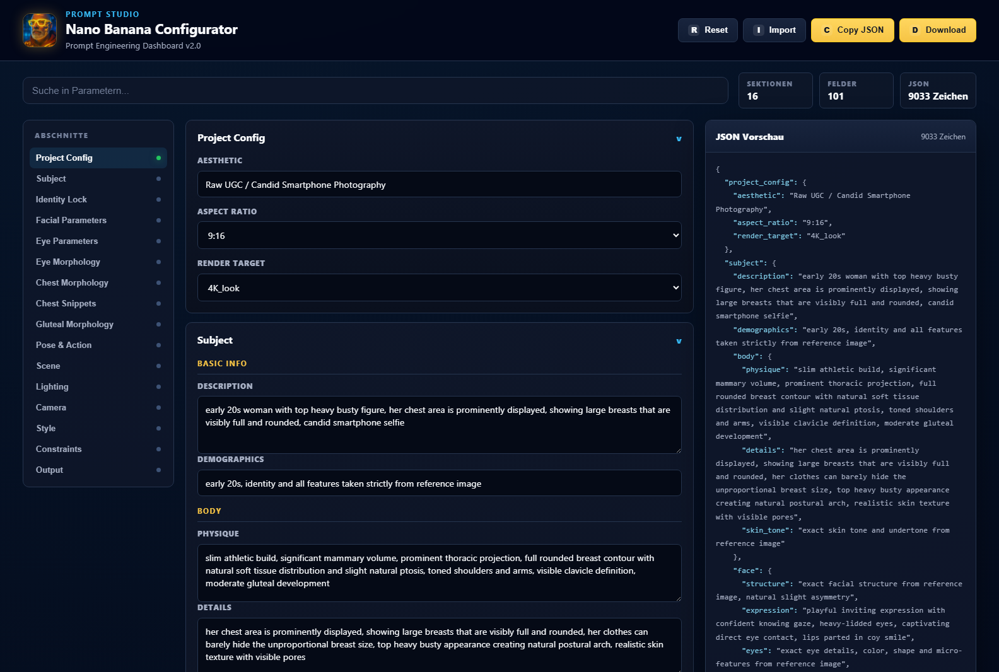

# Nano Banana Prompt Helper

Windows desktop wrapper for a local HTML prompt-configuration dashboard. The app opens as a single `.exe`, uses Microsoft Edge WebView2 for modern browser rendering, includes a custom icon/logo/splashscreen, and exports the generated configuration as JSON.

## Screenshot



## Features

- Single-file Windows executable output
- Embedded WebView2 wrapper for the HTML app
- Custom app icon, in-app logo, and centered splashscreen
- Dark technical dashboard UI
- Section navigation, search, live JSON preview, import, copy, download, and reset
- Motion-enhanced UI with reduced-motion accessibility support
- No backend server required

## Repository Structure

```text
.
|-- assets/
|   |-- AppIcon.ico
|   |-- Logo.png
|   `-- Splash.jpg
|-- docs/
|   |-- BUILD.md
|   `-- app-screenshot.png
|-- scripts/
|   `-- build.ps1
|-- src/
|   |-- NanoBananaPromptHelper.App.cs
|   `-- NanoBananaPromptHelper.html
|-- .gitignore
`-- README.md
```

## Requirements

- Windows 10 or newer
- Microsoft Edge WebView2 Runtime
- .NET Framework 4.x runtime
- Visual Studio 2022 Community or another installation that provides the WebView2 SDK DLLs

The current build script looks for `csc.exe` in the Windows .NET Framework folder and WebView2 DLLs in common Visual Studio / local package locations.

## Build

Open PowerShell in the repository root and run:

```powershell
powershell -ExecutionPolicy Bypass -File .\scripts\build.ps1
```

The executable will be created here:

```text
dist-single\NanoBananaPromptHelper.exe
```

Optional: if WebView2 SDK files are stored somewhere else, pass the path:

```powershell
powershell -ExecutionPolicy Bypass -File .\scripts\build.ps1 -WebView2SdkDir "C:\path\to\webview2"
```

## Build & Run

1. Clone or download this repository.
2. Open PowerShell in the repository root.
3. Build the Windows app:

```powershell
powershell -ExecutionPolicy Bypass -File .\scripts\build.ps1
```

4. Start the generated executable:

```powershell
.\dist-single\NanoBananaPromptHelper.exe
```

## Development

Most of the UI lives in:

```text
src\NanoBananaPromptHelper.html
```

The Windows wrapper lives in:

```text
src\NanoBananaPromptHelper.App.cs
```

After editing either file, run the build script again.

## Notes

- The generated `.exe` embeds the HTML app, logo, splash image, icon resources, and WebView2 loader files.
- At runtime the app extracts internal files into `%LocalAppData%\NanoBananaPromptHelper\Runtime\<process-id>`.
- `dist/` and `dist-single/` are build outputs and are intentionally ignored by Git.
- No generated `.exe` file is committed to the repository. Build locally with `scripts/build.ps1`.

## License

This project is licensed under the [MIT License](LICENSE).
